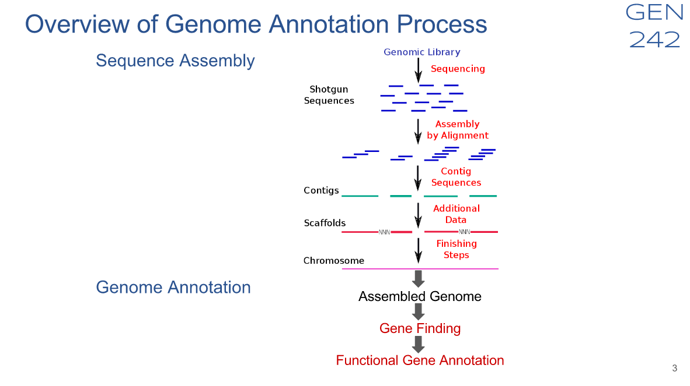

```{r setup, include=FALSE}
knitr::opts_chunk$set(echo = FALSE)

```

## Introduction / Overview

Our research focuses on the need to easily interpret the massive amount of data currently being produced by Next Generation Sequencing (NGS). This is done by integrating various tools into a workflow to produce reproducible research.

### Hello

#### Fouth level.

knitr::opts_chunk$set(echo = TRUE, results = 'markup', warning = TRUE, message = TRUE, fig.path = 'KnitrImages/', comment = NA, background = '#F2F5F9', results = 'hold')


## Next Generation Sequencing - Produces an enormous amount of data for analysis.

Define and demonstrate importance.

## R Markdown by RStudio - Makes Reproducible Research

This is an R Markdown presentation. Markdown is a simple formatting syntax for authoring HTML, PDF, and MS Word documents. For more details on using R Markdown see <http://rmarkdown.rstudio.com>. It's free. You can learn the basics in a single afternoon on your own.

## Gene Set Enrichment - annotates the genes three ways.

GSE tools apply annotation information from online databases like Gene Ontology (GO). New information is added by thousands of users everyday that relates functional and structural purpose to the genes. Another online database the Disease Ontology (DO) relates disease information to the genes.

These growing big data resources are making GSE more powerful and important in diagnosing proper function of cellular tissue.

The word ontology means ...

- MF is Molecular Function
- BP is Biological Process
- CC is Cellular something

## Research Question:

### What is an efficient way to apply Gene Set Enrichment to Next Generation Sequencing?

To efficiently apply GSE to NGS we can take an existing automated workflow environment and then integrate a Gene Set Enrichment tool.

## 'systemPipeR' - provides the automated workflow environment.


## 'clusterProfiler' - attaches Gene Set Enrichment Annotations to the NGS Reads



## My Code - integrates the clusterProfiler enrichment process with the systemPipeR workflow. 

<style>
div.font_em pre.r { font-size: 1.1em; }
div.font_em pre { font-size: 1.0em; }
</style>
<!####hello{.smaller}>
####hello
<>
<div class = "font_em">
```{r clusterProfiler.enrichGO, eval=F, echo=TRUE}
# my code
load(file="descv.RData")
de = names(descv)
if (length(de) == 100) {
	Cutoff = 1.0
} else {
	Cutoff = 0.55
}
Cutoff
ego = clusterProfiler::enrichGO(de, OrgDb = 'org.At.tair.db', keytype="TAIR", ont="MF",
                                pAdjustMethod = "BH", qvalueCutoff=Cutoff, pvalueCutoff=Cutoff)
ego@result[,c(1:7,9)]
ego2 = DOSE::setReadable(yyy, OrgDb = 'org.At.tair.db', keytype="TAIR")
str(ego2)
save(ego, file="ego.RData") # save for clusterProfiler visualization
```
</br>
</div class>
## My Results - of the Enrichment Process

<div class = "font_em">
```{r clusterProfiler.ego.Result, eval=TRUE, echo=TRUE}
# getwd()
if (substr(getwd(),nchar(getwd())-5,nchar(getwd())) != "rnaseq") {
  setwd("rnaseq")
}
load("ego.RData")
ego@result[,c(1:7,9)]
```
</div class>
## My Visualization - of the Enrichment Results (ego)

```{r clusterProfiler.ego.Visualization, eval=TRUE, message=FALSE}
library("clusterProfiler")
load("ego.RData")
# clusterProfiler Visualization
#barplot(ego, showCategory=8)
dotplot(ego)
#enrichMap(ego)
#cnetplot(ego, categorySize="pvalue", foldChange=geneList)
#plotGOgraph(ego)
```

## My Visualization - of the Enrichment Results (ggo)

```{r clusterProfiler.ggo.Visualization, eval=T}
load("ggo.RData")
# clusterProfiler Visualization
barplot(ggo, drop=TRUE, showCategory=12)
```

## GO Slim Barplot for MF Ontology


<div align="center">Figure 5: GO Slim Barplot for MF Ontology</div></br>

## Conclusion

### Summary

Integrating the Gene Set Enrichment tool 'clusterProfiler' in the automated workflow 'systemPipeR' creates an efficient way to apply Gene Set Enrichment to Next Generation Sequencing (NGS) data. Using R and R Markdown qualifies it as reproducible research.

### Review

By writing the code to integrate the 'clusterProfiler' and 'systemPipeR' I was able to create the annotation data and the visualizations to efficiently interpret the results.

### Next steps

Both NGS and GSE are young technologies. It is important to continue updating the workflows and analyses as new discoveries and methods arise.

## Acknowledgements

### Funding Provided by

National Institute of Health under grant ##

### MARC-U-STAR  

PI - Dr. Ernest Martinez

### Girke Lab

PI - Thomas Girke, Department of Botany and Plant Science, University of California, Riverside.

Technical Assistance from Neerja, Jordan, Charles and Austin.

Lab Mates: Jianhai, Yuzhu

### Citations:

G Yu, LG Wang, Y Han, QY He. clusterProfiler: an R package for comparing biological themes among gene clusters. OMICS: A Journal of Integrative Biology 2012, 16(5):284-287. doi:[10.1089/omi.2011.0118](http://dx.doi.org/10.1089/omi.2011.0118)

systemPipeR: NGS workflow and report generation environment
Tyler W. H. Backman and Thomas GirkeEmail authorView ORCID ID profile
BMC BioinformaticsBMC series – open, inclusive and trusted201617:388
https://doi.org/10.1186/s12859-016-1241-0©  The Author(s) 2016

