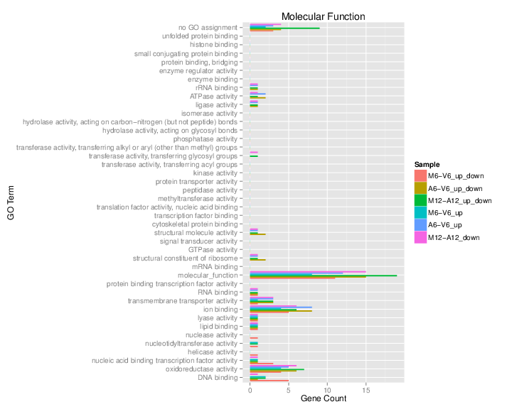

```{r setup, include=FALSE}
knitr::opts_chunk$set(echo = TRUE, results = 'markup', warning = TRUE, message = TRUE, fig.path = 'KnitrImages/', comment = NA, background = '#F2F5F9', results = 'hold')
knitr::opts_chunk$set(echo = FALSE)

```

## Introduction / Overview
<br>
</br>

### Our research focuses on combining existing tools

- systemPipeR - an end-to-end workflow tool for analyzing Next Generation Sequencing (NGS) data
- clusterProfiler - Gene Set Enrichment (GSE) statistical tests, charts and reports
<br>
</br>

### Our research goal

- Integrate clusterProfiler's functional annotations and enrichment methods into systemPipeR
- using R-markdown to produce reproducible research


## Next Generation Sequencing produces an enormous amount of data for analysis.

### What is Next Generation Sequencing

- a massively parallel DNA/RNA sequencing technology
- an entire human genome can be sequenced within a single day
- LOW COST - makes analysis of individual samples feasible

### Analysis of Differentially Expressed Genes (DEGs) is practical

- when testing healthy vs. diseased tissue
- some genes are expressed more than others in one sample
- these are called Differentially Expressed Genes (DEGs)
- DEGs are an important input to the enrichment process

### Analysis of Differentially Expressed Genes (DEGs) is practical

- e.g. used when testing healthy vs. diseased tissue or other treatments
- By treatment, some genes are expressed more than others (differentially expressed), determined by counting them


## The Problem
<br>
</br>

### Currently, the interpretation of gene function

- depends on analysis with new tools that are changing rapidly
- is made difficult by too many tools requiring computational expertise
- is laborious to adjust the data format for each step and to process all the steps
- there is a demand for easy to use workflows

## A Better Way

### A better way is to adopt a workflow that contains the best tools

- manages the data formats for each step
- processes each step automatically in a pipeline using param files
- systemPipeR
    - is easy to learn
    - is flexible
    - is faster
    - and gives better results!
- clusterProfiler
    - contains statistical tests
    - and functional annotation systems

## The Solution

### We integrate clusterProfiler's functional annotations and enrichment methods into systemPipeR

- include the GSEA statistical test
- include the hypergeometric tests
- include a variety of functional annotation systems such as
    - Gene Ontology (GO)
    - pathways (KEGG)
    - Disease Ontology (DO)
    - and more

- The result: an end-to-end analysis ready for human interpretation

## Workflow Overview


## systemPipeR


## Gene Set Enrichment (GSE) annotates the genes many ways.
<br>
</br>

- Using the Gene Ontology (GO) to annotate genes according to
    - MF is Molecular Function
    - BP is Biological Process
    - CC is Cellular Component
- There is also a Disease Ontology database that annotates according to disease terms.
- Enrichment uses the hypergeometric distribution function:
$$ p = \sum_{k=x}^{n} \frac { {D \choose k}{N-D \choose n-k} }{N \choose n}$$
The probability of getting k successes from a sample of size D, where the population has size N of which n are successes.

## R Markdown by RStudio makes Reproducible Research

<br>
</br>

- This is an R Markdown presentation.
- Markdown is a simple formatting syntax for authoring HTML, PDF, and MS Word documents.
- For more details on using R Markdown see <http://rmarkdown.rstudio.com>.
- It's free. You can learn the basics in a single afternoon on your own.

## Our Custom Code integrates the clusterProfiler enrichment process with the systemPipeR workflow. 

<style>
div.font_em pre.r { font-size: 80%; }
div.font_em pre { font-size: 90%; }
</style>
<!####hello{.smaller}>
####hello
<>
<div class = "font_em">
```{r clusterProfiler.enrichGO, eval=F, echo=TRUE}
# my code
load(file="descv.RData")
de = names(descv)
if (length(de) == 100) {
	Cutoff = 1.0
} else {
	Cutoff = 0.55
}
Cutoff
ego = clusterProfiler::enrichGO(de, OrgDb = 'org.At.tair.db', keytype="TAIR", ont="MF",
                                pAdjustMethod = "BH", qvalueCutoff=Cutoff, pvalueCutoff=Cutoff)
ego@result[,c(1:7,9)]
ego2 = DOSE::setReadable(yyy, OrgDb = 'org.At.tair.db', keytype="TAIR")
str(ego2)
save(ego, file="ego.RData") # save for clusterProfiler visualization
```
</div class>
- A sample call to an enrichment function demonstrates how input parameters are read from the disk, processed, and then written back to disk to be used later for graphing and reporting.
- End-users are not concerned with this level. Instead, they simply choose what steps to process.

## Our Results of the Enrichment Process

<div class = "font_em">
```{r clusterProfiler.ego.Result, eval=TRUE, echo=TRUE}
# getwd()
if (substr(getwd(),nchar(getwd())-5,nchar(getwd())) != "rnaseq") {
  setwd("rnaseq")
}
load("ego.RData")
# ego@result[,c(1:7,9)]
ego@result[,c(2:3,5)]
```
</div class>
- A sample data frame, showing the results of the enrichment, demonstrates tabular data used for graphing, reporting, and interpretation. Data is easily imported and exported to Excel.
- Again, end-users simply choose which reports to prepare.

## Our Visualization of the Enrichment Results (ego)

<div class="col-wrapper">
<div class="col col-670">
```{r clusterProfiler.ego.Visualization, eval=T, warning=FALSE, message=FALSE}
library("DOSE", quietly = TRUE)
library("clusterProfiler")
load("ego.RData")
# clusterProfiler Visualization
#barplot(ego, showCategory=8)
dotplot(ego)
#enrichMap(ego)
#cnetplot(ego, categorySize="pvalue", foldChange=geneList)
#plotGOgraph(ego)
```

</div>
<div class="col col-250">
<br>
</br>

This graph shows the Gene Ratio plotted against the GO terms. The dot size represents the count of the genes in each term and the color depicts the significance.

The R language makes using four dimensional charts like this easy, and significantly increases the interpretability of the data.

</div>
</div>

## Our Visualization of the Enrichment Results (ggo)

<div class="col-wrapper">
<div class="col col-670">
```{r clusterProfiler.ggo.Visualization, eval=T, message=FALSE}
load("ggo.RData")
# clusterProfiler Visualization
barplot(ggo, drop=TRUE, showCategory=12)
```

</div>
<div class="col col-250">
<br>
</br>

This graph shows how many clusters of DEGs were assigned to each GO term. The graph was filtered to only show a single category, here showCategory=12.

Visualization of the results makes interpretation easier.

</div>
</div>

## GO Slim Barplot for MF Ontology

<div class="col-wrapper">
<div class="col col-670">

<div align="center">Figure 5: GO Slim Barplot for MF Ontology</div></br>

</div>
<div class="col col-250">
<br>
</br>

Finally, we have selected the most important terms for comparison. Each GO term contains a staggered barplot comparing the various treatments selected. From this view, a researcher or medical professional has a clear overview of the results from which to proceed to interpretation.

Good graphics enable quick and accurate interpretation.

</div>
</div>


## Conclusion

### Benefits
- You simply choose the steps!
    - saves time, less mistakes
    - less trained people can do it

### Summary
- Integrating the Gene Set Enrichment tool `clusterProfiler` in the automated workflow `systemPipeR` creates an efficient way to apply Gene Set Enrichment to Next Generation Sequencing (NGS) data.
- Produced visualizations to efficiently interpret the results.
- Using R and R Markdown qualifies it as reproducible research.

### Next steps
- It is important to continue updating the workflows and analyses as new discoveries and methods arise.

## Acknowledgements

### Funding by   

#### MARC-U-STAR - Program Director - Dr. Ernest Martinez  
<hr>

#### Girke Lab, University of California, Riverside   

#### Primary Investigator - Thomas Girke, Department of Botany and Plant Science
<hr>

Presentation Review - Pedro Rodrigues, University of Sao Paulo, Brazil  
Technical Assistance - Neerja, Jordan, Charles and Austin  
Lab Mates - Jianhai, Yuzhu
