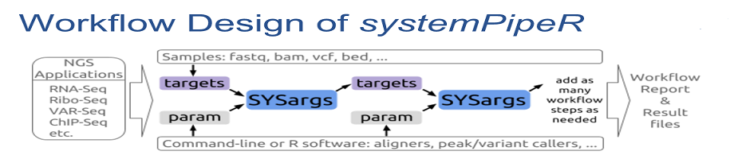
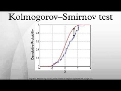

```{r setup, include=FALSE}
knitr::opts_chunk$set(echo = TRUE, results = 'markup', warning = TRUE, message = TRUE, fig.path = 'KnitrImages/', comment = NA, background = '#F2F5F9', results = 'hold')
knitr::opts_chunk$set(echo = FALSE)

```

## Introduction to Bioinformatics Terminology Utilized
<div align="center">

</div>

- Next Generation Sequencing
    - is a LOW COST high-throughput DNA/RNA sequencing technology
    - counting reads that overlap genes gives differentially expressed gene (DEG) lists for enrichment

- Enrichment Methods
    - identify sets of genes that are over-represented in a large set of genes

- Functional Annotation
    - means adding a note specifying what a gene's function is
    - helps understand how a cell/tissue responds to a treatment or disease

## Introduction to systemPipeR </br> <small>an NGS Analysis Workflow Pipeline </small>
<div align="center">

</div>
- Start with your fastq files from the NGS sequencing.  
- Select a param file for each step in your workflow.
    - trimming, alignment, counting DEGs
- Choose which enrichment and annotation steps you want to include.  
    - enrichGO(), enrichmap()
- Submit the job!

## The Problem
<br>
</br>

- Currently, enrichment analysis
    - is made difficult by too many tools requiring computational expertise
    - is laborious to adjust the data format for each step
    - is time consuming to manually process all the steps
<br>
</br>

#### This has created a demand for easy to use workflows

## Objective
<div align="center">

#### <big>To integrate several statistical enrichment tests  and functional annotation systems  into the systemPipeR NGS workflow environment </big>
</div>

<div class="col-wrapper">
<div class="col col-270">

- Chosen statistical methods
- GSEA statistical test
    
<div align="center">

</div>

- hypergeometric tests
$$ p = \sum_{k=x}^{n} \frac { {D \choose k}{N-D \choose n-k} }{N \choose n}$$
</div>
<div class="col col-450 float:right">

- Chosen functional annotation systems
    - Disease Ontology (DO)
    - Gene Ontology (GO)
        - MF is Molecular Function
        - BP is Biological Process
        - CC is Cellular Component
    - KEGG pathways (Kyoto Encyclopedia of Genes and Genomes)

<div align="center">

</div>

</div>
</div>

## Results

- added about 300 lines of code to an instance of systemPipeRNAseq
- integrated new annotation and enrichment functions from G. Yu's clusterProfiler
    - CompareClusters(DEGlist,
    - enrichGO(names(descv),
    - enrichKEGG(names(descv),
    - groupGO(DEGlist,
- visualizations include
    - DOSE::barplot(ego,
    - dotplot(ego,
    - enrichmap(ego,
    - cnetplot(ego,
    - plotGOgraph(ego,

#### The next 4 slides are examples of the work that I've done in R-Markdown

<!    - DOSE::barplot(ggo,>
<>

## Custom code integrates an enrichment process with the systemPipeR workflow. 

<style>
div.font_em pre.r { font-size: 80%; }
div.font_em pre { font-size: 90%; }
</style>
<!####hello{.smaller}>
####hello
<>
<div class = "font_em">
```{r clusterProfiler.enrichGO, eval=F, echo=TRUE}
# my code
load(file="descv.RData")
de = names(descv)
if (length(de) == 100) {
	Cutoff = 1.0
} else {
	Cutoff = 0.55
}
Cutoff
ego = clusterProfiler::enrichGO(de, OrgDb = 'org.At.tair.db', keytype="TAIR", ont="MF",
                                pAdjustMethod = "BH", qvalueCutoff=Cutoff, pvalueCutoff=Cutoff)
ego@result[,c(1:7,9)]
ego2 = DOSE::setReadable(yyy, OrgDb = 'org.At.tair.db', keytype="TAIR")
str(ego2)
save(ego, file="ego.RData") # save for clusterProfiler visualization
```
</div class>
- A call to an enrichment function demonstrates how input parameters are read from the disk, processed, and then written back to disk to be used later for graphing and reporting.
- End-users are not concerned with this level. Instead, they simply choose what steps to process.

## Tabular Results of the Enrichment Process

<div class = "font_em">
```{r clusterProfiler.ego.Result, eval=TRUE, echo=TRUE}
# getwd()
if (substr(getwd(),nchar(getwd())-5,nchar(getwd())) != "rnaseq") {
  setwd("rnaseq")
}
load("ego.RData")
# ego@result[,c(1:7,9)]
ego@result[,c(2:3,5)]
```
</div class>
- A sample data frame, showing the results of the enrichment, demonstrates tabular data used for graphing, reporting, and interpretation. Data is easily imported and exported to Excel.
- Again, end-users simply choose which reports to prepare.

## Visualization of the Enrichment Results

<div class="col-wrapper">
<div class="col col-670">
```{r clusterProfiler.ego.Visualization, eval=T, warning=FALSE, message=FALSE}
library("DOSE", quietly = TRUE)
library("clusterProfiler", quietly = TRUE)
load("ego.RData")
# clusterProfiler Visualization
#barplot(ego, showCategory=8)
dotplot(ego)
#enrichMap(ego)
#cnetplot(ego, categorySize="pvalue", foldChange=geneList)
#plotGOgraph(ego)
```

</div>
<div class="col col-250">
<br>
</br>

- This graph shows the Gene Ratio plotted against the GO terms. The dot size represents the count of the genes in each term and the color depicts the significance.

- The R language makes using four dimensional charts like this easy, and significantly increases the interpretability of the data.

</div>
</div>

## Visualization of the Enrichment Results

<div class="col-wrapper">
<div class="col col-670">
```{r clusterProfiler.ggo.Visualization, eval=T, message=FALSE}
load("ggo.RData")
# clusterProfiler Visualization
barplot(ggo, drop=TRUE, x="Count", showCategory=12)
```

</div>
<div class="col col-250">
<br>
</br>

- This graph shows how many clusters of DEGs were assigned to each GO term.

<!- Visualization of the results makes interpretation easier.>
<>

</div>
</div>

## GO Slim Barplot for Molecular Function (MF) Ontology

<div class="col-wrapper">
<div class="col col-600">

<div align="center">Figure 5: GO Slim Barplot for MF Ontology</div></br>

</div>
<div class="col col-250">

- Finally, we have selected the most important terms for comparison. Each GO term contains a staggered barplot comparing the various treatments selected. From this view, a researcher or medical professional has a clear overview of the results from which to proceed to interpretation.

- Good graphics enable quick and accurate interpretation.

</div>
</div>


## Conclusion

- Benefits
    - You simply choose the steps!
        - saves time, less mistakes, less trained people can do it

- Summary
    - Integrated Gene Set Enrichment into NGS workflow.
    - Included visualizations to assist in interpretation of the results.
    - Provided automated end-to-end gene set enrichment analysis, thus helping researchers obtain results more quickly.

-  Next steps
    - Integrate these new features into the systemPipeR library
    - update workflows and analyses as new discoveries and methods arise

#### This is reproducible research; an R Markdown presentation. See <http://rmarkdown.rstudio.com>.

#### My code is hosted at <https://github.com/gdmosher/systemPipeRNAseqIntegrateClusterProfiler> where you can download and use it!

## Acknowledgements {.smaller}

### Funding by   

#### MARC-U-STAR - Program Director - Dr. Ernest Martinez  
<hr>

#### Girke Lab, University of California, Riverside   

#### Primary Investigator - Thomas Girke, Professor of Bioinformatics, Department of Botany and Plant Sciences
<hr>

Presentation Review - Pedro Rodrigues, University of Sao Paulo, Brazil  
Technical Assistance - Neerja, Jordan, Charles and Austin  
Lab Mates - Jianhai, Yuzhu
<hr>
